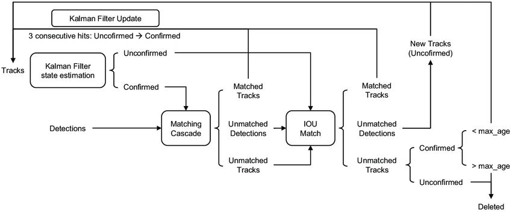
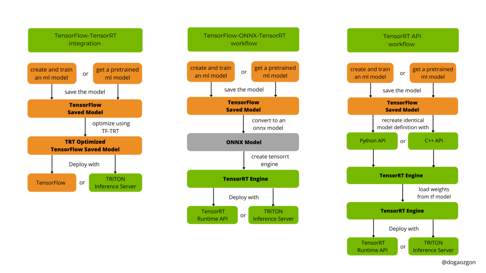

# An object detection task for video on Jetson (YoloV5 and DeepSort with TensorRT)


## Introduction

### Object detection task

Object detection is a computer technology related to computer vision and image processing that deals with detecting instances of semantic objects of a certain class (such as humans, buildings, or cars) in digital images and videos. Well-researched domains of object detection include face detection/recognition, pedestrian detection, image annotation, vehicle counting, activity recognition, video object co-segmentation and so on. It is also used in tracking objects, for example tracking a ball during a football match, tracking movement of a cricket bat, or tracking a person in a video. 

Object detection generally fall into either neural network-based or non-neural approaches: For non-neural approaches, it becomes necessary to first define features, then using a technique such as support vector machine (SVM) to do the classification. In this project, we emphasize the neural techniques that are able to do end-to-end object detection without specifically defining features.

### YOLO series
YOLO(You Only Look Once) is a popular real-time object detection algorithm. It looks at the entire image at once and only once, which allows it to capture the context of detected objects. It combines what was once a multi-step process, using a single neural network to perform both classification and prediction of bounding boxes for detected objects. As such, it is heavily optimized for detection performance and can run much faster than running two separate neural networks to detect and classify objects separately, at the cost of losing some recognition precision which is acceptable in general cases. 

Such advantage making it an ideal choice for applications of real-time detection. Additionally, YOLO can generalize the representations of various objects, making it more applicable to a variety of new environments. Without loss of generality, we adopt the YOLOv5 model as the per-frame object detection in this project.
<center>    
    
    <br>    
    <div style="color:orange; 
                border-bottom: 1px solid #d9d9d9;    
                display: inline-block;    
                color: #999;    
                padding: 2px;">
        Overview of YOLOv5
    </div> 
</center> 


### DeepSORT
DeepSORT is a tracking-by detection algorithm that considers both the bounding box parameters of the detection results, and the information about appearance of the tracked objects to associate the detections in a new frame with previously tracked objects. It is an online/real-time tracking algorithm. Therefore it only considers information about the current and previous frames to make predictions about the current frame without the need to process the whole video at once. 

<center>    
        
    <br>    
    <div style="color:orange; 
                border-bottom: 1px solid #d9d9d9;    
                display: inline-block;    
                color: #999;    
                padding: 2px;">
        Overview of DeepSort workflow
    </div> 
</center> 


Kalman Filter is the key to DeepSort. It gives the best compromise between a prediction and a measurement, the prediction being just a step of a motion model (for tracking at least). The catch is that the prediction is not made into the future, but from the past state to the present one. And then It compare this with last measurement (i.e. tracking result), that gives two estimates of the position, both with uncertainties, so here comes the opportunity tofind a better estimate. 
<center>    
        
    <br>    
    <div style="color:orange; 
                border-bottom: 1px solid #d9d9d9;    
                display: inline-block;    
                color: #999;    
                padding: 2px;">
	       Optimal state estimate
    </div> 
</center> 


The measurement uncertainty is hard to get right on image data, and is usually just selected empirically. Note that the state's uncertainty is also updated in the filter: it will shift a lot of weight on motion data. And the best part of the Kalman filter is that it is recursive, which means where we take current readings to predict the current state, then use the measurements and update the predictions.

<center>    
        
    <br>    
    <div style="color:orange; 
                border-bottom: 1px solid #d9d9d9;    
                display: inline-block;    
                color: #999;    
                padding: 2px;">
        Illustration of Kalman-filter
    </div> 
</center> 


### TensortRT

TensorRT is an SDK for optimizing trained deep learning models to enable high-performance inference. TensorRT contains a deep learning inference optimizer for trained deep learning models, and a runtime for execution. After we have got the trained deep learning models, they can be handled by TensorRT with higher throughput and lower latency. In this project, TensortRT is leveraged to parse and accelerate the inference of the pretrained models of Yolo and DeepSORT. 

<center>    
    
    <br>    
    <div style="color:orange; 
                border-bottom: 1px solid #d9d9d9;    
                display: inline-block;    
                color: #999;    
                padding: 2px;">
        Typical deep learning development cycle using TensorRT.
    </div> 
</center> 


### Jetson platform for embedding development 

Nvidia Jetson is a series of embedded computing boards. Jetson is a low-power system and is designed for accelerating machine learning applications. In this project, we use a Jetson TX2 model as the development/deployment target. 

[Hardware specification](https://developer.nvidia.com/embedded/jetson-tx2):

1. Model: Jetson TX2
2. CPU: Dual-Core NVIDIA Denver 2 64-Bit CPU
3. Quad-Core ARM® Cortex®-A57 MPCore
4. GPU: 256-core NVIDIA Pascal™ GPU architecture
5. Memory: 8GB 128-bit LPDDR4 Memory 1866MHz - 59.7 GB/s
6. Storage: 32GB eMMC 5.1

[Software specification](https://developer.nvidia.com/embedded/downloads):
1. OS: Ubuntu 20.04
2. JetPack: 5.0.1 DP
3. CUDA: 11.4.14
4. cuDNN: 8.3.2
5. TensorRT: 8.4.0.11 (DP)
6. Triton 22.03

<center>    
    
    <br>    
    <div style="color:orange; 
                border-bottom: 1px solid #d9d9d9;    
                display: inline-block;    
                color: #999;    
                padding: 2px;">
        The Jetson TX2 board.
    </div> 
</center> 


## Implementation

### Model building

We temporarily skip the model training phase which starts from the bare skeleton and use pre-trained models from the community resource. Here are the reasons: 

1. Due to the restriction of test data and insufficient hardware resource, it would be quiet time-consuming to start from the sketch.
2. The open source version of Yolov5 and Deepsort has been proved they can yield satisfying performance and accurate predict results.
3. If necessary in near feature, we still can do the fine-tune on the pre-trained network using some customized data to achieve better result.

### Model conversion/deployment

There are three main options for converting a model with TensorRT:

1. TF-TRT: For converting TensorFlow models, the TensorFlow integration (TF-TRT) provides both model conversion and a high-level runtime API, and has the capability to fall back to TensorFlow implementations where TensorRT does not support a particular operator. 
1. Programmatic ONNX conversion from .onnx files:  A more performant option for automatic model conversion and deployment is to convert using ONNX. TensorRT supports automatic conversion from ONNX files using either the TensorRT API, or trtexec. ONNX conversion is all-or-nothing, meaning all operations in the model must be supported by TensorRT (or users must provide custom plugins for unsupported operations). The end result of ONNX conversion is a singular TensorRT engine that allows less overhead than using TF-TRT.
1. Manually constructing a network using the TensorRT API (either in C++ or Python): In this case, the network architecture is built by calling TensorRT APIs. Then a weight file is used to define the edge weights. By combing the network structure and weights, the initial neural network model has been restored. And it can be handled by TensorRT for the next setup of deployment.

<center>    
    
    <br>    
    <div style="color:orange; 
                border-bottom: 1px solid #d9d9d9;    
                display: inline-block;    
                color: #999;    
                padding: 2px;">
        Three principles of TensorRT drivers
    </div> 
</center> 

In this project, we decided to use the approach 2 since the pretrained network in the .onnx format can be successfully translated by TensortRT.

### Program workflow

According the explaination abolve, the program workflow is pretty straightforword and easy to understand:

1. The original input can be the video capture or the offline video file, which is done by OpenCV API;
2. Use the YoloV5 engine to inference all objects in the current frame;
3. Use the DeepSort engine to track all moving objects;
4. Use the box to mark all identified objects;
5. Use the OpenCV API to draw the final result to the console;

<center>    
    
    <br>    
    <div style="color:orange; 
                border-bottom: 1px solid #d9d9d9;    
                display: inline-block;    
                color: #999;    
                padding: 2px;">
        The diagram of our program runtime.
    </div> 
</center> 


##  Project explanation
###  Directory structures

The structure details of the project are described as following:
1. yolo: the header/source code for the YoloV5 model;
2. deepsort: the header/source code for the DeepSort model;
3. include: the common header directory across the whole project;
4. src: the source code for the main module;
5. build: the directory holding the outpu binaries including the final result;
6. resources: the directory holds the model onnx files and video clips used for testing purpose;

### Test data preparation

We use the following sources to generate our test videos:
1. [7AM London bus ride through the heart of London - Oxford St, Piccadilly, Big Ben - Bus Route 453 🚌 - YouTube](https://www.youtube.com/watch?v=aDaVU3O2e00&ab_channel=Wanderizm)
1. [Amsterdam street view Elandsgracht - Centrum - YouTube](https://www.youtube.com/watch?v=_MMpKnfT5oU&ab_channel=ThomasSchlijper)
1. [Waikiki, Hawaii, USA | Street Walk | Shopping and Waikiki Beach - YouTube](https://www.youtube.com/watch?v=FUcTGx-pfvI&ab_channel=SKINNYSCOOLVIDEOS)
1. [🔴Tokyo Walk 24/7🚶‍♀️【🌈Urban Paradise】🏙 Shibuya, Shinjuku, Ikebukuro, etc.😊💖Please Subscribe!💖⬇︎⬇︎⬇︎ - YouTube](https://www.youtube.com/watch?v=gC4dJGHWwDU&ab_channel=JapanWalk)
1. [Paris Drive 4K - Sunset Drive - France - YouTube](https://www.youtube.com/watch?v=FBjjYw-xcdg&ab_channel=JUtah)

### Project build 

####  Prerequisites
1. OpenCV library;
2. Boost library;
3. Eigen3 library;
4. Cuda/Cudnn/Tensort libraries(usually installed by default);

#### Commands
```shell 
cd tensorrtx/yolov5
// update CLASS_NUM in yololayer.h if your model is trained on custom dataset
mkdir build
cd build
cmake ..
make
```
### Launch 
To the built executable is pretty straightforward:
```shell
./yolosort video_file_input_path
```
Here are some notes:
1. Please put the .onnx or the .engine files in the same directory as the executable file.

2. The default name for the model files are deepsort[.onnx/.engine] and yolov5s[.onnx/.engine].

3. If the input network files are in .onnx suffix, the program will try to convert them to TensorRT engine files first.

4. If the input network files are engine files, the program will go to the inference procedure directly.

5. In this experiments, offline video files are used. As for the real-world deployment, we can switch to the online camera by simple do the following:

```c++
cv2.VideoCapture(0);
```

### Results
Here are some screenshots from our experiments. Please check the video file for the whole results. From the result videos, we can observe following conclusions:

1. The program can output result at XXX FPS, which falls in the range that we believe to be acceptable.
2. Using human supervision, the output boxes cover most cognizable objects that appears in the video. 

We believe our current implementation has achieved our goal at this moment.


## Future works

Our future works are oriented by following aspects:
1. continuous optimization of performance to make the program keep high performance when there exist many(100+) cognizable objects;
1. try to apply some more sophisticated industry models, such as YoloX, SSD and so on;
1. adapt to more Jetson models and runtime versions: the TensorRT engine files are not universal across different versions. In this case, it is necessary to pre-compile different engine files for different runtime versions in order to save the deployment consumption. 

## Project resource:

1. the code package: http://20.112.98.130:8080/code.zip
2. the demo video: http://20.112.98.130:8080/demo.mp4

## Reference

### Articles/Papers:
1. You Only Look Once: Unified, Real-Time Object Detection
https://arxiv.org/abs/1506.02640
1. Simple Online and Realtime Tracking with a Deep Association Metric
https://arxiv.org/abs/1703.07402
1. TensorRT
https://developer.nvidia.com/tensorrt
1. DeepStream
https://developer.nvidia.com/deepstream-sdk

### Pretrained models:
1. https://github.com/ultralytics/yolov5

